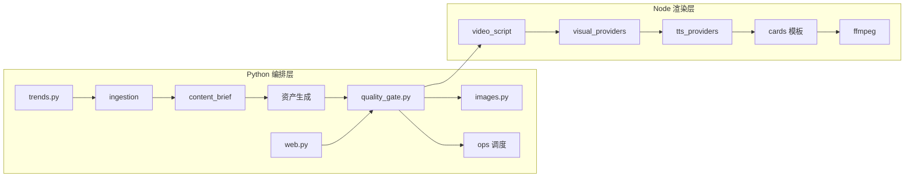
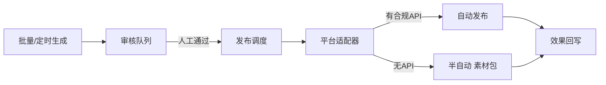

# 高质量内容架构优化路线图

> **用途**：本仓库实施计划的权威文档。Cursor Plan 与 Codex（`hotspot-content-engine` skill）改架构、质量、多平台或运营相关代码前，请先读本文。
>
> **状态**：阶段 A 与 **B-import（X 粘贴搬运 MVP）** 已落地；其余阶段按 checkbox 推进。实施过程中请在本文件顶部「实施进度」区更新 checkbox。
>
> **相关文档**：[business-goal-low-cost-content-ops.md](./business-goal-low-cost-content-ops.md) · [content-engine-architecture.md](./content-engine-architecture.md) · [dashboard-redesign-spec.md](./dashboard-redesign-spec.md) · [CODEX.md](../CODEX.md)

## 实施进度

- [x] **阶段 A**：视频可发布基线（LLM 口播、腾讯云 TTS、配图评分、质量门禁 v1）
- [x] **阶段 B-import（高优）**：X **粘贴全文** → 忠实本地化 → 小红书 + 公众号双稿（`content_origin: x_paste`，无 X API）
- [x] **阶段 B-文风**：`writing_style` + `xhs-calm-writing` skill（克制小红书文案，配置化禁用词）
- [x] **阶段 B-质检**：`proofread` + `critique_revise` + `writing_pipeline`（`config/ai_tone_rules.json`）
- [x] **阶段 B-brief**：`content_brief` 先于成稿（`content_brief.enabled`）
- [ ] **阶段 C**：多平台触达（小红书 / 视频号 / 抖音 / **今日头条**、`platform_packages`、`performance`）
- [x] **阶段 C-反馈 MVP**：`data/hit_library.json` + `POST /api/performance` + `hit_library.py`
- [ ] **阶段 D**：X / YouTube 参考引入（`ingestion`、`source_references`、二次创作）
- [x] **阶段 E（MVP）**：`queue/`、`ops/calendar.json`、`ops/cron-pipeline.sh`、`--prepare-slot`、`GET /api/ops/status`、Web 运营面板
- [ ] **阶段 E（完整）**：审核队列状态机、Publisher Playwright 草稿箱、告警通知

**已确认的产品选择**：

- 外部源：**参考改写**（非原样搬运）；保留 `source_references` 溯源
- 自动化：**半自动优先**（生成 + 审核 + 发布包/创作中心；无合规 API 不无人值守发帖）

### 外部参考（2025-05）

[Hermes + 头条自动化实战](https://mp.weixin.qq.com/s/eG7ISR5JtW8IwtwjQkwl9Q)（链接有验证墙，分析见 Cursor 计划「公众号文章启发分析」）：

- **可复用**：多工序 Writer（正则 + 评委及格线）、文件队列 + slot、只进草稿箱 + 人审、hit_library 反哺选题、Ops Dashboard 读日志/JSON
- **不迁移**：不必整体换成 Hermes；用 Python cron + `queue/` + 现有 JSON 事实源即可
- **全量实施清单**：见仓库内计划文件 `公众号文章启发分析`（Writer 质检 / brief / ops / Web 运营 Tab）

---

## 目标概述

在保持「可控成本 + 可审核 + JSON 事实源」前提下，升级为：

**多源输入（百度热点 + X/YouTube 参考）→ Brief 驱动 → 质量门禁 → 多平台发布包 → 半自动运营**

短期聚焦视频可发布质量；中期打通小红书、视频号、抖音、今日头条；长期在有合规接口前提下实现调度化运营。

---

## 现状与差距

商业目标要求：**先定义最低可发布质量，再优化成本**；产出平台无关资产组（`content_brief`、`video_plan`、`platform_packages`），并记录成本与效果。

| 维度 | 现状 | 质量瓶颈 |
|------|------|----------|
| 文字稿 | `generator.py` 单一「小红书策划」Prompt | 无 `content_brief`；钩子/结构无评分 |
| 视频文稿 | `video-plan.js` 规则引擎 `rule_based_node_analysis_v2` | 口播偏模板化；未用 LLM 提质 |
| 封面/配图 | `images.py` 默认 `local_cover` | 吸睛度依赖本地排版 |
| 视频配图 | `image-assets.js` 即梦默认每视频 1 张复用 | 多场景视觉重复；仅 WIMGS 有评分 |
| 音色 | `tts.js` 支持 `tencent_tts`，仍可能走 `macos_say` | 发布级需配置档 + 成本写回 |
| 字幕/画面 | SVG 卡片 + 真实 TTS 重排时长 | 无烧录字幕；平台样式参数级差异 |
| 数据模型 | 文档有 `platform_packages`、`performance` | **代码未实现** |
| 外部源 | `trends.py` 支持 baidu/rss/json | 无 X/YouTube 结构化引入 |
| 触达渠道 | cards 有 xiaohongshu/douyin/shipinhao | **今日头条未覆盖** |
| 自动化 | `publisher.mode: draft_only` | 无日历、审核队列、跨平台调度 |

```mermaid
flowchart TB
  subgraph today [当前管线]
    H[百度热点] --> G[LLM 小红书草稿]
    G --> J[output JSON]
    J --> I[local_cover / OpenAI 图]
    J --> V[规则 video_plan]
    V --> M[素材链 + TTS + SVG卡片 + ffmpeg]
  end

  subgraph target [目标管线]
    subgraph sources [多源输入]
      H2[百度热点]
      XRef[X 参考帖]
      YT[YouTube 元数据/字幕]
    end
    sources --> ING[ingestion 归一化]
    ING --> B[content_brief LLM]
    B --> A[social_post / article_plan / video_script]
    A --> Q[质量门禁]
    Q --> P[Provider 图文图音]
    P --> R[渲染合成]
    R --> PK[platform_packages]
    PK --> OPS[运营层 日历/队列/发布]
    OPS --> PERF[performance 复盘]
  end
```



---

## 设计原则

1. **质量线先于成本线**：`quality_tier: draft | standard | publish`，不同档位绑定 provider 与额度。
2. **Brief 是中枢**：热点/种子 → `content_brief` → 派生图文稿与视频稿；正文不硬套口播。
3. **高价值步骤用 LLM，稳定结构用规则**：分镜、字幕切分、ffmpeg 保持规则；钩子、标题、配图 prompt 用 LLM。
4. **Provider 可插拔 + 可评分 + 可写回成本**：统一 `estimated_cost_cny`。
5. **不破坏事实源**：`output/YYYY-MM-DD/*.json` 仍为唯一真相；新字段向后兼容。
6. **外部源 = 参考改写**：X/YouTube 提取观点/字幕/结构 → 中文原创；`source_references` 溯源；不用他人视频画面作成片。
7. **半自动运营**：审核队列 + 发布包 + 创作中心深链；无合规 API 不无人值守发帖。

---

## 目标架构（分层）



### 层 0：多源引入 — X / YouTube

**模块**：`xhs_hotspot_poster/ingestion/`

| 来源 | 接入（优先级） | 产出 |
|------|----------------|------|
| X | 官方 API / 手动 URL（MVP） | `source_references[]` |
| YouTube | yt-dlp 元数据+字幕 / 手动 URL | + `transcript_excerpt` |
| 现有 | 扩展 `trends.py` rss/json | 统一 `content_seeds` |

**JSON 字段**：

```json
"content_seeds": [
  { "platform": "baidu", "title": "...", "url": "..." },
  { "platform": "youtube", "title": "...", "url": "...", "transcript_excerpt": "..." }
],
"source_references": [
  { "platform": "x", "url": "...", "usage": "argument|quote|structure", "attribution": "@" }
]
```

**合规**：不抓私密帖；YouTube 只用字幕做观点提炼；敏感类 `manual_review_required: true`。

**配置**（`config.example.json` 扩展）：

```json
"ingestion": {
  "enabled_sources": ["baidu", "manual_url"],
  "x": { "mode": "manual_url", "api_bearer_env": "X_API_BEARER" },
  "youtube": { "mode": "metadata_transcript", "max_duration_minutes": 20 }
}
```

### 层 1：内容智能 — 文字吸引力

**模块**：`content_brief.py`、`content_pipeline.py`、`proofread.py`、`critique_revise.py`，改造 `generator.py` / `repurpose.py`

- `generate_content_brief()` → `facts[]`、`hook_lines[]`、`visual_direction`、`title_hooks[]` 等
- `run_writing_pipeline()`：初稿 → `proofread`（`config/ai_tone_rules.json`）→ `critique_revise`（&lt;70 重写 ≤2 轮）→ `writing_pipeline` 写入 JSON
- 派生 `social_post_plan`、`video_script_seed`、预留 `article_plan`
- 顶层字段 `body`、`title_options` 保持扁平映射，兼容 Web/发布包

### 层 2：质量门禁

**模块**：`quality_gate.py` → `quality_report: { score, checks[], publish_ready, tier }`

检查项：标题、正文结构、封面字数、视频稿句长、配图、发布档 TTS、来源标注（阶段 D 后）。

### 层 3：媒体 Provider

`quality_profiles` 示例：

```json
"quality_tier": "standard",
"quality_profiles": {
  "draft": {
    "image_generation.provider": "local_cover",
    "video_generation.voice_provider": "macos_say",
    "max_jimeng_calls_per_video": 0
  },
  "publish": {
    "image_generation.provider": "openai_image",
    "video_generation.voice_provider": "tencent_tts",
    "max_jimeng_calls_per_video": 2
  }
}
```

- 视频配图：`scoreCandidateImage` 统一评分；`per_scene_budget` 策略
- TTS：发布档 `tencent_tts`；后续 `volcengine` / `elevenlabs` 适配器

### 层 4：视频合成

- Python `video_script.py` 生成口播；Node `video-plan.js` 只分镜/字幕
- 字幕：平台 preset 联动字数；可选 ffmpeg 烧录 `video_burned.mp4`
- `cards.js`：xiaohongshu / douyin / shipinhao / **toutiao** 模板包

### 层 5b：多平台触达

| 平台 | 形态 | 规格 |
|------|------|------|
| 小红书 | 图文 + 9:16 视频 | 封面强 |
| 视频号 | 短视频 | `shipinhao` preset |
| 抖音 | 15–60s 强钩子 | `douyin` preset |
| 今日头条 | 微头条/图文/视频 | 新 `toutiao` preset；可选 16:9 |
| 公众号 | 长文 | `article_plan` |

**模块**：`platform_adapters/build_package(post, platform)` → `platform_packages`

### 层 6：半自动运营



- **L1**：launchd/cron、`ops/calendar.json`、`ops/cron-pipeline.sh`、`ops_runner.py --prepare-slot`
- **L1b**：`queue/pending/{07:00,12:00,...}/` + `.meta.json`（`writing_pipeline` 分数）
- **L2**：`workflow_status`: draft → in_review → approved → scheduled → published
- **L3**：`ops/adapters/`；`publisher.mode`: draft_only（cron 层禁止 `--publish` 直发）

**模块**：`ops_runner.py`、`ops_status.py`、`hit_library.py`（后续 `ops/adapters/`）

### 层 7：数据闭环

JSON 字段 `performance: { platform, published_at, views, cost_cny, revenue_cny }`；Web 手动录入；反推模板与 provider ROI。

---

## 分阶段落地

### 阶段 A（2–3 周）：视频可发布基线

| 任务 | 主要文件 | 产出 |
|------|----------|------|
| LLM 视频口播 | 新 `video_script.py`，`video-plan.js` | 钩子+短句口播 |
| 发布档 TTS | `tts.js`，`render.js` | 腾讯云 + 成本写回 |
| 配图升级 | `image-assets.js`，config | 统一评分 + per_scene_budget |
| 字幕/模板 | `cards.js`，`ffmpeg.js` | preset + 可选烧录 |
| 质量门禁 v1 | 新 `quality_gate.py`，Web | publish_ready |

**验收**：45s 内；前 3s 钩子；腾讯云 TTS；高质量竖图；`publish_ready=true`（publish 档）。

### 阶段 B（2 周）：图文吸引力

- `content_brief` + `generator.py` 改造
- 封面 publish 档（OpenAI/即梦 + brief prompt）
- Web 标题选择与 brief 预览

### 阶段 C（3–4 周）：多平台触达

- `platform_packages`（含今日头条）
- `toutiao` preset + 可选 16:9
- `performance` 录入 + Web 发布 Tab

### 阶段 D（3–4 周）：X / YouTube 参考

- `ingestion` + `content_seeds` / `source_references`
- Web 粘贴链接导入种子
- Brief 二次创作约束 + 来源质量项

### 阶段 E（4–6 周）：半自动运营

- `workflow_status` + 审核队列 UI
- `ops/scheduler` + 内容日历
- Publisher Adapter 接口（有 API 时）

**依赖**：A → B（可部分并行 C）；D 在 B 后；E 依赖 C。

---

## 成本参考（publish 档 / 条视频）

- LLM（brief + 正文 + 视频稿）：约 3 次 DeepSeek flash
- 即梦：1–2 张 × 0.25 元
- 腾讯 TTS：按字数 ≪ 1 元
- 腾讯 WIMGS：0–1 次 × 0.06 元（fallback）

**合计约 0.5–1.5 元/条视频 + LLM**

---

## 关键文件索引

| 阶段 | 文件 |
|------|------|
| A | `video_script.py`，`generator.py`，`video-plan.js`，`image-assets.js`，`cards.js`，`tts.js`，`web/app.js`，`config.example.json` |
| B | `content_pipeline.py`，`quality_gate.py`，`images.py` |
| C | `publisher.py`，`web.py`，`platform_adapters/`，`cards.js` |
| D | `ingestion/`，`trends.py`，`generator.py` |
| E | `ops/scheduler.py`，`ops/adapters/`，`web/app.js` |

---

## 风险与边界

- **版权**：X/YouTube 仅参考改写；成片不用他人视频画面
- **ToS**：无官方 API 不做 unattended 发帖；Playwright 非默认
- **API 稳定性**：X RSS 桥易失效；生产优先官方 API 或手动 URL
- **Remotion/AI 视频**：短期不纳入；9:16 用 cards+ffmpeg；头条横版裁切/第二模板
- **付费烟测**：遵守 [CODEX.md](../CODEX.md) SOP

---

## 立即下一步

1. **阶段 A**：Brief/种子 → LLM 视频口播 → 腾讯云 TTS → 分场景配图 → 质量门禁
2. **并行设计** `platform_packages` schema（含今日头条）
3. **阶段 D MVP**：Web 粘贴 X/YouTube 链接 → 种子 → Brief（零 API）
4. **阶段 E**：跑通「审核 → 多平台发布包」后再加调度

**完整路线**：A 视频质量 → B 图文 → C 四平台包 → D 海外参考源 → E 半自动运营

---

## 阶段 A 实施清单（Codex / Agent 执行用）

> 用户已确认「开始执行阶段 A」。在 **Agent 模式**下按此清单改代码；完成后勾选上文「阶段 A」并更新本节前各子项。

### A1 — LLM 视频口播

| 动作 | 文件 |
|------|------|
| 新增 `generate_video_script_seed()` | `xhs_hotspot_poster/video_script.py` |
| 生成视频稿前调用 LLM，写入 `video_script_seed` | `xhs_hotspot_poster/web.py` → `generate_draft_video_plan` |
| 从 seed 构建分镜（规则只负责时长/字幕） | `video-renderer/src/video-plan.js` → `buildVideoPlanFromSeed` |
| API 失败走 `template_fallback` | `video_script.py` + `web.py` |

### A2 — 发布档 TTS 与成本

| 动作 | 文件 |
|------|------|
| `quality_tier` + `quality_profiles` | `config.example.json` |
| 合并 profile 到有效 video/image 配置 | `xhs_hotspot_poster/quality_config.py` + `render.js` → `applyQualityProfile` |
| publish 档默认 `tencent_tts` | `quality_profiles.publish` |
| 写回 `tts_estimated_cost_cny`、总成本 | 已有 `render.js`，补 `estimated_total_cost_cny` |

### A3 — 配图评分与分场景策略

| 动作 | 文件 |
|------|------|
| `image_scene_strategy`: `reuse_single_premium` \| `per_scene_budget` | `config.example.json` |
| 统一 `scoreCandidateImage`；Pexels 选最优竖图 | `video-renderer/src/image-assets.js` |
| 首尾场景可用即梦，中间场景跳过即梦 | `attachBackgroundImages` |

### A4 — 字幕与模板

| 动作 | 文件 |
|------|------|
| 按 `style_preset` 调整字幕切分字数 | `video-plan.js` → `subtitleMaxCharsForStyle` |
| 有底图时降低字幕遮罩 opacity | `video-renderer/src/cards.js` |
| 可选烧录字幕 `burn_subtitles` | `ffmpeg.js` + `render.js` |

### A5 — 质量门禁 v1 + Web

| 动作 | 文件 |
|------|------|
| 新增 `evaluate_post()` | `xhs_hotspot_poster/quality_gate.py` |
| 生成视频稿/视频后写回 `quality_report` | `web.py` |
| 检查面板展示分数与 `publish_ready` | `web/app.js` → `renderStatusPanel` |

### A6 — 验证（零成本优先）

```bash
python3 -m compileall -q xhs_hotspot_poster
node --check video-renderer/src/video-plan.js
node --check video-renderer/src/image-assets.js
node --check video-renderer/src/render.js
node --check web/app.js
/Users/zhangmiao/.codex/skills/hotspot-content-engine/scripts/health_check.sh
```

付费烟测（仅用户明确要求时）：1 条草稿走「生成视频稿 → 按稿生成视频」，publish 档 + 腾讯云 TTS。
