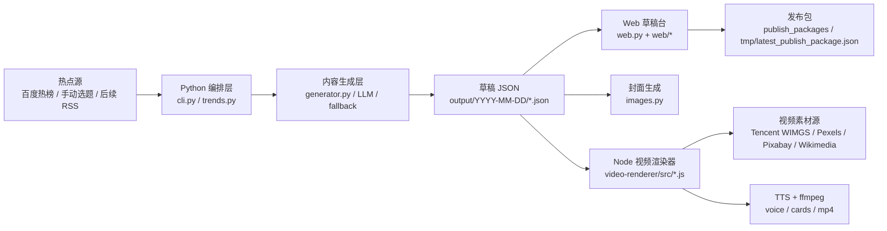

# 热点内容生成引擎架构规范

本项目正在从“小红书草稿工具”升级为“可控成本自动化内容运营系统”。核心目标是：热点输入统一、内容资产平台无关、视频和图文生成独立、多平台发布包可插拔、质量和付费调用可控，最终服务于可复盘的被动收入实验。

## 当前架构



## 模块职责

### Python 编排层

- `xhs_hotspot_poster/cli.py`：命令入口，负责 `--once`、`--dry-run`、`--serve`、`--publish`。
- `xhs_hotspot_poster/trends.py`：热点抓取、来源兼容、SSL 回退、基础去重。
- `xhs_hotspot_poster/generator.py`：把热点和账号定位转成平台无关草稿；LLM JSON 异常时走 fallback，不让整批生成失败。
- `xhs_hotspot_poster/images.py`：封面生成、本地 SVG/PNG、OpenAI 图片、上传图处理。
- `xhs_hotspot_poster/openai_client.py`：OpenAI 文本/图片调用封装，兼容本机证书问题。
- `xhs_hotspot_poster/video_bridge.py`：只负责调用 Node CLI，不实现视频核心逻辑。
- `xhs_hotspot_poster/web.py`：本地 HTTP API、静态页面、草稿读取、发布包、手动刷新。
- `xhs_hotspot_poster/storage.py` / `publisher.py`：草稿落盘和发布包/发布接口。

### Node 视频渲染层

视频核心必须放在 `video-renderer/`，方便 review 和后续替换渲染方案。

- `src/render.js`：CLI 总入口，读草稿、生成/复用视频计划、调用素材、TTS、ffmpeg、写回 JSON。
- `src/video-plan.js`：从热点草稿生成视频专用分析稿、短句字幕、分镜和关键词。视频文案不能直接复用图文正文。
- `src/image-assets.js`：素材搜索、缓存、图片评分、成本统计；腾讯 WIMGS 调用次数必须受配置限制。
- `src/cards.js`：生成 1080x1920 场景卡片和字幕画面。
- `src/tts.js`：TTS 封装。当前是 macOS `say`，属于 MVP 方案，音色不是最终质量标准。
- `src/ffmpeg.js`：图片序列、分段音频、最终 MP4 合成和媒体探测。
- `src/subtitles.js`：字幕文件和字幕分段辅助。

### Web 草稿台

Web 只做审核、编辑、触发和预览，不做复杂业务判断。

- 左侧列表默认展示最新 10 条，并提供手动“生成今日热点”按钮。
- 详情区分为草稿、封面/配图、视频、发布包。
- 视频流程必须是“生成/编辑视频文稿 -> 生成视频 -> 预览 -> 发布包”，不能直接隐藏文稿。
- 任何错误都应该留在当前草稿上展示，不能闪一下又跳回第一篇。

## 数据模型

`output/YYYY-MM-DD/*.json` 是当前事实源。重要字段：

- `selected_topic`：本次热点或选题。
- `angle`：内容角度。
- `title_options`：图文标题候选。
- `body`：图文正文，适合阅读，不适合直接口播。
- `cover_text`：封面文字。
- `image_ideas`：封面/配图建议。
- `hashtags`：平台标签。
- `generated_image`：封面或配图结果。
- `video_plan`：视频文稿、分镜、字幕、素材关键词和时长。
- `generated_video`：视频路径、URL、素材来源、成本和字幕路径。
- `video_generation_error` / `image_generation_error`：失败信息，Web 必须显示。

新增字段优先保持平台中立；小红书、公众号、抖音等平台差异放到 `platform_packages` 或发布包适配层。

## 成本与质量规范

- 页面加载、列表刷新、查看草稿不能触发付费 API。
- `--dry-run` 不能调用 LLM、图片、TTS 或视频素材付费接口。
- 手动“生成今日热点”会调用 LLM，应在 UI 上显示状态，失败不能清空当前页面。
- 视频素材搜索必须尊重 `video_generation.max_tencent_wimgs_calls_per_video`，默认最多 2 次。
- 腾讯 WIMGS 费用按当前估算：1000 次 60 元，约 0.06 元/次；每次生成视频要写回估算成本。
- 调试流程时优先使用零成本配置：`image_providers: []`、`max_tencent_wimgs_calls_per_video: 0`。
- 面向发布时不刻意追求免费。素材、TTS、图片和视频 provider 应以“质量达标 + 成本可控 + ROI 可复盘”为准。
- 免费源、本地源、低价源和高质量付费源都应通过 provider 层接入，允许 A/B 对比质量、成本和效果。

## 质量规范

### 内容

- 生成逻辑应基于当天热点和配置栏目，不能长期复用旧标题。
- 图文稿适合读，视频稿适合听；两者不互相硬套。
- 视频口播每句尽量短，避免一个字幕段塞长复句。
- 财经、房产、公共事件必须保留风险提示，不荐股、不做确定性判断。

### 视频

- 口播、字幕、画面要按分段时长同步。当前以“每段字幕单独 TTS -> 探测音频时长 -> 反推分镜时长”为基线。
- 远程配图必须经过评分过滤，低质量、广告感、过度杂乱的图宁可不用。
- 不允许大面积纯黑遮罩盖住底图；字幕背景只能服务可读性。
- macOS `say` 只是流程验证工具。要达到可发布质量，应新增专业 TTS 适配器，如腾讯云 TTS、火山引擎、阿里云或 ElevenLabs。

### UI

- 左侧选择状态必须稳定；生成封面、生成视频、错误返回后仍停留当前草稿。
- 页面结构应偏“工作台”，少用营销式大卡片。高频操作要靠近预览区。
- 错误、成本、素材来源、生成时间必须显式显示。
- 视频文稿必须可见、可编辑、可保存后再渲染。

## 缓存和清理

可以安全清理：

- `__pycache__/`
- 视频中间场景图：`output/**/assets/*-scene-*`
- 分段 TTS 中间文件：`output/**/assets/*-voice-*.aiff`
- 远程图片缓存：`output/**/assets/remote_images/`
- 临时字幕、旧视频、旧音频，前提是草稿 JSON 不再引用它们。

不要默认删除：

- `output/**/*.json`
- `output/**/*.md`
- `publish_packages/`
- 用户上传图片
- 当前草稿引用的 `generated_image` / `generated_video`

## 验证清单

低成本基础检查只用于验证代码，不代表发布质量：

```bash
python3 -m compileall -q xhs_hotspot_poster
python3 -m xhs_hotspot_poster --config config.json --dry-run
node --check video-renderer/src/render.js
node --check video-renderer/src/video-plan.js
node --check video-renderer/src/image-assets.js
node --check web/app.js
```

服务检查：

```bash
python3 -m xhs_hotspot_poster --serve
```

打开 `http://127.0.0.1:8765` 或当前端口，确认左侧列表、手动刷新、封面预览、视频文稿和错误展示可用。

视频烟测优先使用零成本配置；只有用户明确要测试腾讯 WIMGS 时，才允许真实调用图片搜索。

## 相关规范

- 产品北极星：`docs/business-goal-low-cost-content-ops.md`
- UI 工作台改造：`docs/dashboard-redesign-spec.md`
- 本地 Codex skill：`/Users/zhangmiao/.codex/skills/hotspot-content-engine`

## 演进路线

1. 稳定架构和规范：明确 Python/Node/Web 边界，沉淀 skill 与验证脚本。
2. 重做 Web 工作台：改成更清晰的审核流，修复视觉层级和交互反馈。
3. 提升视频质量：接入专业 TTS、改良分镜模板、优化图片评分和素材授权标注。
4. 多平台适配：从同一份内容资产导出小红书、公众号、抖音不同发布包。
5. 自动发布：只在有合规 API 或用户授权的情况下接入，默认保持人工审核。
