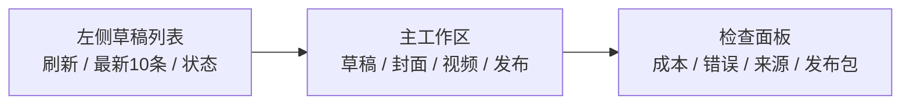

# 草稿工作台 UI 改造规范

当前页面已经能完成抓取、预览、封面、视频和发布包，但信息层级和操作反馈偏散。下一阶段 UI 先按“审核工作台”重构，不做营销页。

## 目标

- 左侧快速定位最新草稿。
- 中间清楚展示当前草稿的内容资产。
- 右侧或下方集中展示生成状态、成本、错误、发布包。
- 视频必须先审文稿，再生成。
- 所有按钮点击后不能改变当前选中文章，除非用户主动选择另一篇。

## 页面结构

## 左侧列表

- 顶部固定：
  - “生成今日热点”
  - “刷新列表”
  - 今日生成数量和最新生成时间
- 列表默认最新 10 条。
- 每条显示：
  - 标题短句
  - 日期时间
  - 状态标记：有封面、有视频、有错误
- 点击生成封面、视频或发布包后，当前选中项必须保持。

## 主工作区

用四个标签页：

- `草稿`：标题、正文、标签、风险提示。
- `封面/配图`：当前封面预览、生成方式、打开文件、重新生成、上传。
- `视频`：视频文稿编辑器、分镜摘要、生成视频、视频预览、字幕文件。
- `发布`：发布包内容、复制、打开目录、平台适配。

## 视频交互

视频页必须按这个顺序：

1. 生成或读取 `video_plan`。
2. 展示可编辑口播文稿，短句分段明显。
3. 用户保存文稿。
4. 生成视频。
5. 展示视频、字幕、素材来源和估算成本。

不能把图文正文直接塞进视频；视频口播需要单独的分析稿。

## 状态与错误

- 生成中按钮进入 loading，不允许重复点击。
- 错误显示在当前模块旁边，不用弹窗一闪而过。
- 后端返回错误时，不刷新选中 ID。
- 成功后局部合并草稿数据，不强制跳到第一篇。

## 视觉方向

- 风格偏工具台：紧凑、清晰、少装饰。
- 卡片只用于草稿条目、预览容器和错误块，不要卡片套卡片。
- 封面和视频预览保持 9:16 固定比例。
- 按钮按动作分组：生成、保存、打开、发布包。
- 不用大面积黑遮罩；图片可读性靠局部渐变和字幕底条解决。

## 实施顺序

1. 稳定状态模型：`selectedDraftId`、loading map、error map。
2. 拆分 UI 区域：列表、草稿、封面、视频、发布。
3. 重做视频页：文稿编辑先于渲染。
4. 重做预览比例和错误展示。
5. 再调整视觉样式和密度。
